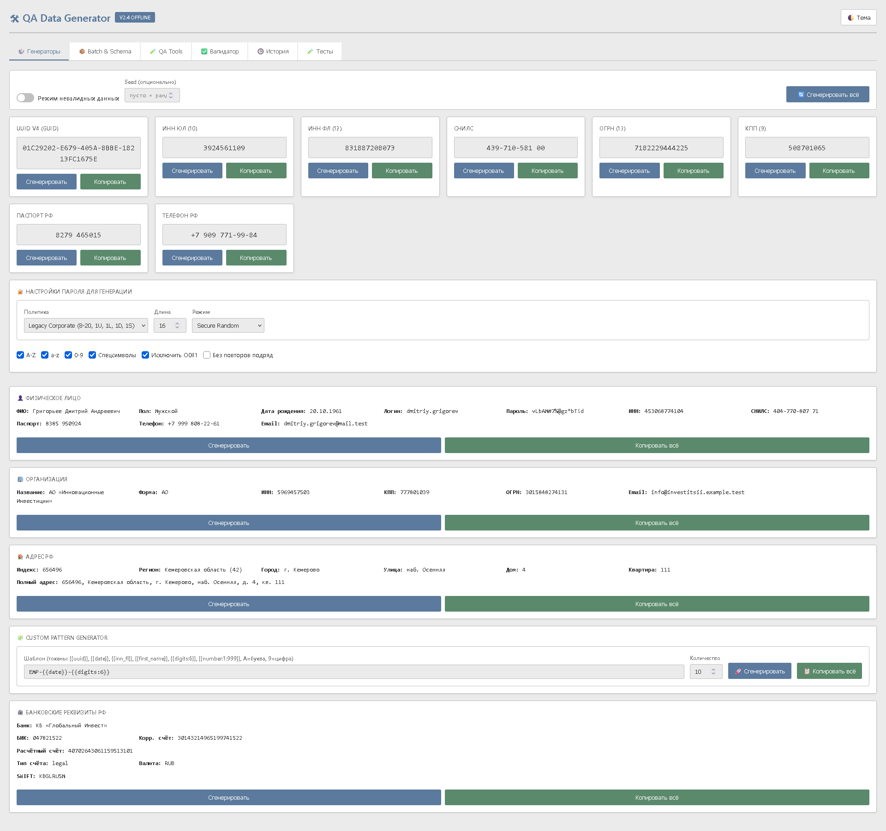
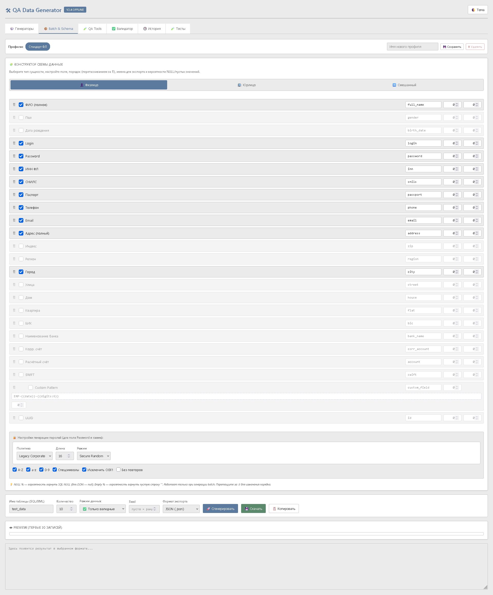
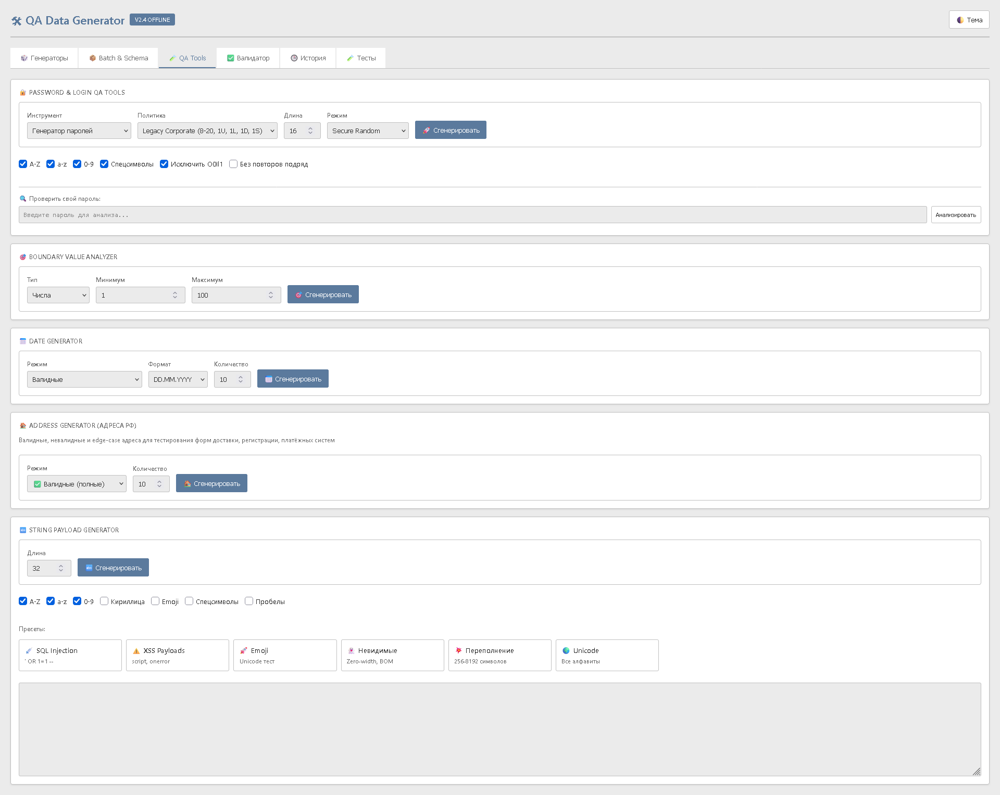
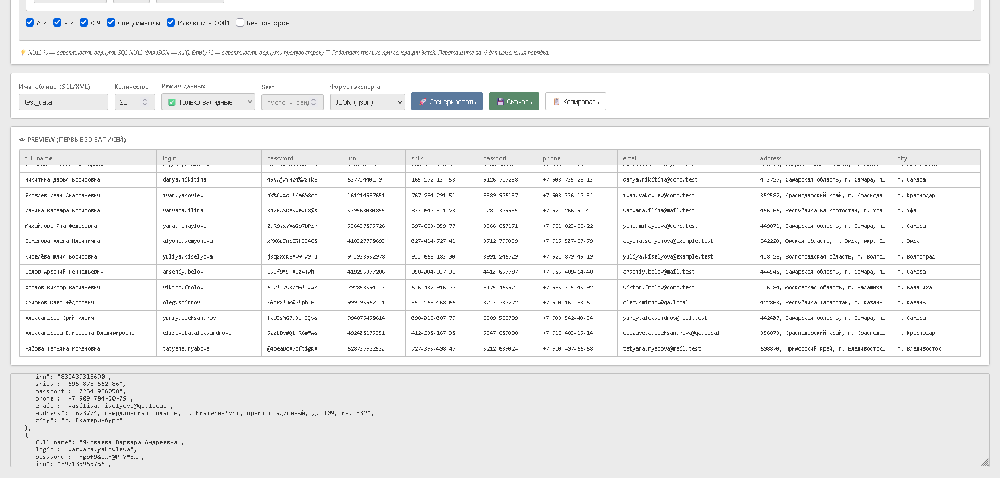
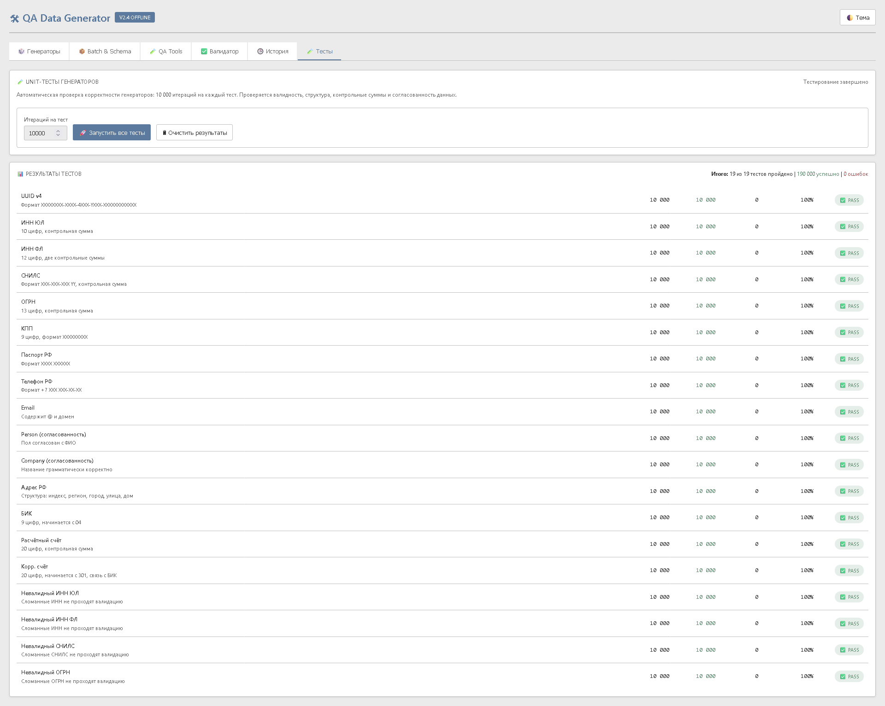

# 🛠 QA Data Generator

**Автономный офлайн-инструмент для генерации синтетических тестовых данных**  
Специализация: российские идентификаторы, негативное тестирование, edge cases, password policies.


[🇬🇧 English](#english-version) | [🇷🇺 Русский](#русская-версия)

---

# 🇷🇺 Русская версия

## 🎯 О проекте

**QA Data Generator** — законченное решение для QA-инженеров, автоматизаторов и разработчиков, позволяющее генерировать **математически корректные** синтетические данные без интернета, серверов и внешних зависимостей. Работает прямо из браузера через `file://` двойным кликом.

### 💡 Почему этот проект существует

Инструменты вроде Faker и Mockaroo отлично справляются с базовыми задачами — случайные имена, email, адреса на английском. Но при тестировании систем, работающих с российскими реквизитами, регулярно возникают специфические задачи:

- **Математически валидные идентификаторы.** ИНН, СНИЛС, ОГРН, БИК и расчётные счета — это не просто случайные цифры. У каждого есть своя контрольная сумма, и бэкенд-валидатор справедливо их отвергает, если она не сходится. QA Data Generator реализует алгоритмы ФНС, ПФР и ГОСТ Р 58523-2019, чтобы сгенерированные данные проходили реальные проверки.
- **Негативное тестирование из коробки.** Помимо валидных данных нужны невалидные и граничные значения: `min-1`, `max+1`, `29.02.1900`, пустые поля, спецсимволы, переполнения. Отдельный режим и набор QA Tools делают это одной кнопкой.
- **Автономность.** Иногда нет возможности поднять npm-пакет или отправить данные на сторонний сервис (закрытый контур, офлайн-стенд, NDA). Один HTML-файл работает везде, где есть браузер.
- **Воспроизводимость.** Seed-режим позволяет зафиксировать набор данных и точно воспроизвести его в баге, автотесте или отчёте.
- **Русскоязычные сущности.** Согласованные по полу ФИО, грамматически корректные названия компаний, адреса с реальной структурой регионов и индексов.

Инструмент не претендует на замену Faker или Mockaroo — у них свои сильные стороны и свои задачи. QA Data Generator решает узкий, но часто встречающийся класс задач: **синтетические данные для тестирования систем с российскими реквизитами, с акцентом на валидацию и негативные сценарии.**

---

## ✨ Возможности

### 🎲 Генераторы идентификаторов

| Сущность | Описание | Валидация |
|----------|----------|-----------|
| **UUID v4** | Криптостойкий через `crypto.randomUUID()` + fallback | RFC 4122 |
| **ИНН ЮЛ** | 10 цифр | Контрольная сумма ФНС |
| **ИНН ФЛ** | 12 цифр | Две контрольные суммы |
| **СНИЛС** | `XXX-XXX-XXX YY` | Алгоритм ПФР |
| **ОГРН** | 13 цифр | Деление на 11 |
| **КПП** | 9 цифр | Структура ФНС (регион + ИФНС + причина + №) |
| **Паспорт РФ** | `XXXX XXXXXX` | Формат МВД |
| **Телефон РФ** | `+7 XXX XXX-XX-XX` | Реальные коды операторов |

### 👤 Сущности

#### Физическое лицо (согласованные данные)
- **ФИО** с автоматическим согласованием по полу:
  - Мужские отчества на `-ич`, женские на `-на`
  - Правильные окончания фамилий
- **Login** в 7 стилях: `first.last`, `last.first`, `f.last`, `last.f`, `compact`, `numbered`, `random`
- **Password** с политиками: Legacy Corporate, Strong, Passphrase, NIST-like, Custom
- Дата рождения (18–80 лет)
- Транслитерированный email (`anna.ivanova@example.test`)

#### Организация (грамматически корректные названия)
- Согласование прилагательного с родом существительного:
  - *«Цифровая Логистика»* (женский род)
  - *«Северный Проект»* (мужской род)
  - *«Новое Развитие»* (средний род)
  - *«Промышленные Технологии»* (множественное число)
- **1060+ уникальных** грамматически корректных комбинаций
- Реалистичные ОПФ: ООО, АО, ПАО

#### Адрес РФ (географически корректный)
- 20 регионов с привязкой индексов
- Специфичные улицы для Москвы и СПб
- 13 типов улиц с согласованием по роду (`бул. Стадионный`, `ул. Стадионная`, `ш. Можайское`)
- Реалистичные дома (с корпусами `к.5`, строениями `стр.2`, дробями `10/2`)

#### Банковские реквизиты РФ
- **Синтетические** БИК (математически валидные, не привязаны к реальным банкам)
- Корр. счёт, согласованный с БИК (6-8 цифры совпадают)
- Расчётный счёт с **контрольной суммой по ГОСТ Р 58523-2019**
- SWIFT-код, генерируемый из названия банка

---

### 🧩 Schema Builder

- Выбор типа сущности: **Физлицо / Юрлицо / Смешанный**
- **Drag-and-drop** порядок полей (работает на десктопе и touch-устройствах)
- Custom export names (`fullName` → `customer_name`)
- **Nullable %** и **Empty %** для каждого поля
- **Custom Pattern** — поле с пользовательским шаблоном
- Сохраняемые профили (Presets) в localStorage

---

### 🔐 Password Generator & Meter

**Генератор:**
- Режимы: **Secure Random** (`crypto.getRandomValues`) и **Deterministic** (через Seed)
- Политики:
  - **Legacy Corporate** — 8-20 символов, 1 upper + 1 lower + 1 digit + 1 special
  - **Strong Test** — 16 символов, все наборы
  - **Passphrase** — 4 слова + число (`correct-horse-river-planet-47`)
  - **NIST-like** — min 12, без композиционных правил (согласно NIST SP 800-63B)
  - **Custom** — пользовательские настройки
- Исключение похожих символов (`O0Il1`)
- Запрет повторов подряд

**Password Strength Meter:**
- Расчёт энтропии в битах (по размеру алфавита)
- 6 категорий сложности с цветовой индикацией
- Оценка времени взлома (при 10 млрд попыток/сек)
- Проверка соответствия 4 политикам одновременно
- Отдельный анализатор пользовательских паролей

---

### 🧩 Custom Pattern Generator

Мощный шаблонизатор для корпоративных форматов:

**Токены:**
```
{{uuid}}              — UUID v4
{{date}}              — YYYY-MM-DD
{{inn_fl}}            — ИНН ФЛ (12 цифр)
{{inn_ul}}            — ИНН ЮЛ (10 цифр)
{{snils}}             — СНИЛС
{{ogrn}}              — ОГРН
{{kpp}}               — КПП
{{phone}}             — Телефон РФ
{{email}}             — Email
{{passport}}          — Паспорт РФ
{{bic}}               — БИК
{{account}}           — Расчётный счёт
{{first_name}}        — Имя (согласованный)
{{last_name}}         — Фамилия
{{middle_name}}       — Отчество
{{full_name}}         — ФИО полностью
{{login}}             — Login
{{password}}          — Password
{{company_name}}      — Название организации
{{company_inn}}       — ИНН организации
{{company_ogrn}}      — ОГРН организации
{{digits:N}}          — N случайных цифр
{{letters:N}}         — N случайных букв
{{number:min:max}}    — случайное число в диапазоне
```

**Маска:**
- `A` = случайная буква (A-Z)
- `9` = случайная цифра (0-9)

**Примеры:**
```
EMP-{{date}}-{{digits:6}}          → EMP-2026-09-30-482917
{{first_name}}.{{last_name}}       → aleksey.ivanov
AA-999999                          → QF-572184
{{company_name}} / ИНН {{inn_ul}}  → ООО «Северный Проект» / ИНН 7712345678
ORD-{{date}}/{{digits:5}}          → ORD-2026-09-30/48291
```

---

### 🧪 QA Tools

#### Boundary Value Analyzer
- Классический набор: `min-1, min, min+1, среднее, max-1, max, max+1`
- Для чисел и длин строк

#### Date Generator (5 режимов)
- Валидные случайные даты
- **Невалидные**: `31.02`, `29.02.1900` (не високосный!), `00.00.0000`
- Граничные значения возраста (точный порог ±1 день)
- Диапазон дат с границами
- Edge cases: Y2K, Unix epoch, високосные года

#### Address Generator (4 режима)
- Валидные полные / по частям
- Невалидные (13 типов ошибок: нет дома, латиница, спецсимволы, неверный индекс)
- Edge cases (сёла, ПГТ, микрорайоны)

#### String Payload Generator
- Настройка длины (1–10 000) и наборов символов
- **6 пресетов**: SQL Injection, XSS Payloads, Emoji, Невидимые символы, Переполнение, Unicode

---

### ✅ Валидатор

Мгновенная проверка с детальным описанием ошибки:

| Тип | Что проверяется |
|-----|-----------------|
| ИНН ЮЛ / ИНН ФЛ | Длина + контрольная сумма |
| СНИЛС | Формат + контрольная сумма |
| ОГРН | Длина + деление на 11 |
| Адрес РФ | Индекс, населённый пункт, улица, дом |
| БИК | 9 цифр, начинается с `04` |
| Расчётный счёт | 20 цифр, контрольная сумма по ГОСТ |
| Корр. счёт | 20 цифр, связь с БИК (6-8 цифры) |

---

### 📦 Batch & Export

**6 форматов экспорта:**

| Формат | Особенности |
|--------|-------------|
| **JSON** | Массив объектов |
| **CSV** | С UTF-8 BOM для корректной кириллицы в Excel |
| **SQL INSERT** | PostgreSQL/SQLite, правильное экранирование, `NULL` для пустых |
| **XML** | С `xsi:nil="true"` для null-значений |
| **Excel (.xls)** | Легковесный HTML-формат, открывается как таблица |
| **Текст (.txt)** | Построчный вывод |

**Режимы данных:**
- ✅ Только валидные
- ❌ Только невалидные
- 🔀 Смешанные (с настраиваемым процентом брака)

**Preview Table** — табличный просмотр первых 20 записей с подсветкой `NULL` и `""`.

---

### 🧪 Unit-тесты

Встроенный фреймворк самодиагностики:
- **19 тестовых сценариев**
- **10 000 итераций** на тест (настраивается до 100 000)
- Проверка: форматы, контрольные суммы, согласованность, негативные кейсы
- Inline-отчёт с деталями ошибок (без модальных окон)
- Прогресс-бар и сводная статистика

**Тесты покрывают:**
- Все базовые генераторы (UUID, ИНН, СНИЛС, ОГРН, КПП, паспорт, телефон, email)
- Person (согласованность пола и ФИО)
- Company (грамматическая корректность)
- Address (структура и валидация)
- Bank (БИК, р/с, к/с)
- Негативные тесты (сломанные ИНН/СНИЛС/ОГРН не проходят валидацию)

---

### 🎨 UX

- 🌓 Тёмная / светлая тема
- 🎨 Классическая деловая палитра (в духе 1С)
- 📱 Адаптивный дизайн
- 🔔 Toast-уведомления вместо модальных окон
- 🕒 История последних 20 генераций в localStorage
- 🌱 **Seed** для 100% воспроизводимости наборов
- ⚡ Детерминированный UUID при Seed

---

## 🚀 Сценарии использования

### 1. Ручное тестирование форм
Быстрое заполнение сложных форм регистрации, оформления заказов, банковских анкет валидными и невалидными данными.

### 2. Автотесты (API/UI)
Генерация JSON/CSV файлов для параметризованных тестов (Data-Driven Testing).

### 3. Наполнение БД
Массовая генерация SQL-скриптов для staging-сред с правильными контрольными суммами.

### 4. Тестирование валидаций
Использование режимов «Невалидные данные» и QA Tools для проверки граничных условий и обработки ошибок на бэкенде.

### 5. Проверка импорта/экспорта
Генерация файлов с edge-cases (эмодзи, нулевая ширина, длинные строки) для стресс-тестирования парсеров.

### 6. Тестирование политик паролей
Password Meter с проверкой соответствия Legacy, Strong, NIST, Passphrase — идеально для аудита систем аутентификации.

### 7. Корпоративные форматы
Custom Pattern Generator для генерации номеров заказов, договоров, артикулов:
```
ORD-{{date}}-{{digits:6}}   → ORD-2026-09-30-482917
ART-{{letters:2}}{{digits:4}} → ART-QF5721
```

---

## 🏗 Архитектура

Код внутри single-file организован в **20 чётких секций**:

```
1.  Core Helpers         (escape, clipboard, toast)
2.  Seedable PRNG        (mulberry32)
3.  Dictionaries         (ФИО, компании, регионы, улицы)
4.  Base Generators      (uuid, inn, snils, ogrn, kpp, ...)
5.  Person Entity        (согласованное ФИО + Login + Password)
6.  Company Entity       (грамматические названия)
7.  Address Entity       (географически корректные)
8.  Bank Entity          (синтетические БИК + ГОСТ Р 58523-2019)
9.  Validators           (контрольные суммы)
10. Schema Definitions   (PERSON_FIELDS, COMPANY_FIELDS)
11. Schema Builder UI    (drag-and-drop)
12. Presets              (сохраняемые профили)
13. Field Generator      (с учётом nullable/empty)
14. Exporters            (JSON/CSV/SQL/XML/XLS/TXT)
15. QA Tools             (boundary, dates, strings, patterns)
16. Password Meter       (OWASP/NIST политики)
17. UI Logic             (генераторы)
18. Batch Generation     (preview, export)
19. Unit Tests           (19 тестов)
20. Init
```

Эта структура позволяет легко **распилить файл на модули** при переходе к v3.0.

---

## 🔒 Безопасность и автономность

- ✅ **Полностью офлайн** — 0 внешних запросов
- ✅ **Не передаёт данные наружу** — всё остаётся в браузере
- ✅ **Работает с `file://`** — открывается двойным кликом
- ✅ **Без зависимостей** — не требует npm, Node.js, сборки
- ✅ **Криптостойкость** — `crypto.randomUUID()` и `crypto.getRandomValues()`
- ✅ **Защита от XSS** — экранирование HTML-спецсимволов
- ✅ **Защита от SQL-инъекций** — санитизация имён таблиц
- ✅ **Защита от XML-инъекций** — экранирование в XML/XLS

---

## 🗺 Roadmap

### ✅ v2.4 (текущая) — Feature freeze single-file
- Login/Password Generator с политиками
- Password Strength Meter (OWASP/NIST)
- Custom Pattern Generator с токенами сущностей
- Детерминированный UUID при Seed
- Inline-ошибки в тестах (без модальных окон)
- Синтетические банки (без привязки к реальным)
- Грамматически согласованные адреса

### 🔜 v3.0 — Modular Architecture
- Разделение на `src/` (ES6-модули), `tests/` (Jest), `dist/` (сборка)
- GitHub Actions для автоматической сборки single-file
- Полноценное README с примерами API

### 🔜 v3.1 — Relational Datasets
- Генерация связанных таблиц: `customers` → `orders` → `payments`
- Внешние ключи с гарантией целостности

### 🔜 v3.2 — Custom Dictionaries & Templates
- Загрузка пользовательских CSV/JSON словарей
- Расширенный шаблонизатор с условной логикой

### 🔜 v3.3 — CLI & Desktop Pro
- CLI: `qa-gen --schema crm.json --count 100000 --format sql`
- Desktop Pro (Tauri): проекты, история, большие датасеты (>1M строк)

---

## 📊 Сводная таблица возможностей

| Категория | Количество |
|-----------|:---:|
| Базовых генераторов | 8 |
| Сущностей (Person/Company/Address/Bank) | 4 |
| Форматов экспорта | 6 |
| Режимов генерации | 3 (valid/invalid/mixed) |
| QA-пресетов строк | 6 |
| Режимов генератора дат | 5 |
| Password Policy Presets | 5 |
| Валидаторов | 8 |
| Unit-тестов | 19 |
| Вкладок в интерфейсе | 6 |
| Токенов Pattern Generator | 20+ |

---

## 🛠 Технологии

- **HTML5 + CSS3 + Vanilla JavaScript (ES5)**
- **Web Crypto API** (`crypto.randomUUID`, `crypto.getRandomValues`)
- **localStorage** для истории и профилей
- **HTML5 Drag-and-Drop API** для Schema Builder
- **Mulberry32 PRNG** для seedable-генерации
- **ГОСТ Р 58523-2019** для контрольных сумм р/с
- **OWASP Cheat Sheet Series** и **NIST SP 800-63B** для password policies

---

## 📦 Установка

### Быстрый старт
1. Скачайте `qa-data-generator.html` из раздела **Releases**
2. Откройте двойным кликом в любом современном браузере
3. Готово! Никакой установки, никаких зависимостей

### Из исходников
```bash
git clone https://github.com/RomanLarichev/qa-data-generator.git
cd qa-data-generator
# Просто откройте qa-data-generator.html в браузере
```

---

## 📄 Лицензия

MIT License — свободное использование в коммерческих и открытых проектах. Полный текст — в файле [`LICENSE`](LICENSE).

---

## 🤝 Вклад

Проект открыт для предложений и улучшений:
- Нашли ошибку в алгоритмах контрольных сумм? Создайте issue.
- Хотите добавить новый тип данных? Pull request приветствуется.
- Есть идея для новой QA-фичи? Обсудим в Discussions.

---

## ⚠️ Дисклеймер

> Все генерируемые данные являются **синтетическими** и предназначены исключительно для тестирования. Случайное совпадение с реальными идентификаторами возможно, но маловероятно и не является целью инструмента. Генератор создаёт *форматно и математически корректные* номера, но **не проверяет** их наличие в реестрах ФНС/ПФР/ЦБ.
>
> Названия банков и их реквизиты — синтетические. Для работы с реальными банками используйте официальный справочник БИК ЦБ РФ.

---

## 🎯 Позиционирование

> **QA-oriented synthetic data generator with Russian business data and negative/edge-case generation.**

Инструмент не пытается конкурировать с Faker по количеству типов данных. Его сила — в **глубокой специализации** на российских идентификаторах, негативном тестировании и password policies.

---

## 📸 Скриншоты

**Главный экран** — генераторы российских идентификаторов и сущностей:


**Schema Builder** — конструктор схемы с drag-and-drop:


**Password Generator & Meter** — генерация и анализ стойкости паролей:


**Batch Preview** — предпросмотр и экспорт в 6 форматов:


**Unit Tests** — встроенный фреймворк самодиагностики:


---

## 🙏 Благодарности

- **ФНС России** — алгоритмы контрольных сумм ИНН
- **ПФР** — алгоритм контрольной суммы СНИЛС
- **ЦБ РФ** — структура БИК и корр. счетов
- **ГОСТ Р 58523-2019** — контрольная сумма расчётного счёта
- **OWASP** — рекомендации по password policies
- **NIST SP 800-63B** — современные требования к паролям

**⭐ Если проект оказался полезен — поставьте звезду на GitHub!**

---

# 🇬🇧 English Version

## 🎯 About

**QA Data Generator** is a complete offline solution for QA engineers, SDETs, and developers to generate **mathematically correct** synthetic test data without internet, servers, or external dependencies. Works directly from the browser via `file://`.

### 💡 Why this project exists

Tools like Faker and Mockaroo handle the basics well — random names, emails, English addresses. But testing systems that deal with Russian business identifiers brings specific challenges:

- **Mathematically valid identifiers.** INN, SNILS, OGRN, BIK and settlement accounts aren't just random digits. Each has its own checksum, and a backend validator will rightly reject data that doesn't match. QA Data Generator implements FNS, PFR and GOST R 58523-2019 algorithms so the generated data passes real validations.
- **Negative testing out of the box.** Besides valid data you need invalid and boundary values: `min-1`, `max+1`, `29.02.1900`, empty fields, special characters, overflows. A dedicated mode and QA Tools make this a one-click task.
- **Autonomy.** Sometimes you can't pull an npm package or send data to a third-party service (closed environment, offline stand, NDA). One HTML file runs anywhere a browser exists.
- **Reproducibility.** Seed mode pins down a dataset and lets you replay it exactly in a bug report, autotest, or ticket.
- **Russian-language entities.** Gender-consistent full names, grammatically correct company names, addresses with real region and postal-code structure.

The tool doesn't aim to replace Faker or Mockaroo — they have their own strengths and use cases. QA Data Generator solves a narrow but frequently occurring class of tasks: **synthetic data for testing systems that use Russian business identifiers, with an emphasis on validation and negative scenarios.**

---

## ✨ Features

### 🎲 Identifier Generators
- **UUID v4** — cryptographically secure
- **INN UL/FL** — 10/12 digits with FNS checksums
- **SNILS** — format `XXX-XXX-XXX YY` with PFR checksum
- **OGRN** — 13 digits with mod-11 checksum
- **KPP** — 9 digits (region + tax office + reason + number)
- **Russian Passport** — `XXXX XXXXXX`
- **Russian Phone** — `+7 XXX XXX-XX-XX`

### 👤 Entities

**Person** (gender-consistent):
- Full name with correct patronymics and surname endings
- Login in 7 styles: `first.last`, `last.first`, `f.last`, `compact`, `numbered`, `random`
- Password with policies: Legacy, Strong, Passphrase, NIST-like, Custom
- Birth date (18–80 years)
- Transliterated email

**Company** (grammatically correct):
- Adjective agrees with noun gender: *"Digital Logistics"*, *"Northern Project"*
- 1060+ unique combinations

**Address** (geographically correct):
- 20 regions with correct postal codes
- Street types agree with names (`Boulevard Stadiumny`, `Street Stadionnaya`)

**Bank Details**:
- Synthetic BIK (mathematically valid)
- Correspondent account linked to BIK
- Settlement account with **GOST R 58523-2019** checksum
- SWIFT code generated from bank name

### 🧩 Schema Builder
- Entity type: Person / Company / Mixed
- **Drag-and-drop** field ordering
- Custom export names
- **Nullable %** and **Empty %** per field
- **Custom Pattern** field with user template
- Saved presets in localStorage

### 🔐 Password Generator & Meter
- **Modes**: Secure Random (`crypto.getRandomValues`) and Deterministic (via Seed)
- **Policies**: Legacy Corporate, Strong, Passphrase, NIST SP 800-63B, Custom
- **Password Strength Meter**:
  - Entropy calculation in bits
  - 6 complexity categories
  - Crack time estimation (at 10B attempts/sec)
  - Compliance check against 4 policies simultaneously
  - User password analyzer

### 🧩 Custom Pattern Generator
Powerful templating for corporate formats:

```
EMP-{{date}}-{{digits:6}}          → EMP-2026-09-30-482917
{{first_name}}.{{last_name}}       → aleksey.ivanov
AA-999999                          → QF-572184
{{company_name}} / INN {{inn_ul}}  → ООО «Северный Проект» / INN 7712345678
```

**Available tokens:** `{{uuid}}`, `{{date}}`, `{{inn_fl}}`, `{{inn_ul}}`, `{{snils}}`, `{{ogrn}}`, `{{kpp}}`, `{{phone}}`, `{{email}}`, `{{passport}}`, `{{bic}}`, `{{account}}`, `{{first_name}}`, `{{last_name}}`, `{{middle_name}}`, `{{full_name}}`, `{{login}}`, `{{password}}`, `{{company_name}}`, `{{company_inn}}`, `{{company_ogrn}}`, `{{digits:N}}`, `{{letters:N}}`, `{{number:min:max}}`

**Mask:** `A` = random letter, `9` = random digit

### 🧪 QA Tools
- **Boundary Value Analyzer** — `min-1, min, min+1, mid, max-1, max, max+1`
- **Date Generator** — 5 modes (valid, invalid, age boundaries, range, edge cases)
- **Address Generator** — 4 modes (valid, parts, invalid, edge cases)
- **String Payload Generator** — 6 presets (SQLi, XSS, Emoji, Zero-width, Overflow, Unicode)

### ✅ Validators
Instant validation with detailed error messages for INN, SNILS, OGRN, Address, BIK, Settlement Account, Correspondent Account.

### 📦 Batch & Export
**6 export formats:** JSON, CSV (with UTF-8 BOM), SQL INSERT, XML (with `xsi:nil`), Excel (.xls), Text

**Data modes:** Valid / Invalid / Mixed (with configurable invalid ratio)

**Preview Table** — tabular view of first 20 records with `NULL` and `""` highlighting.

### 🧪 Unit Tests
Built-in self-diagnostic framework:
- **19 test scenarios**
- **10,000 iterations** per test (configurable up to 100,000)
- Checks: formats, checksums, consistency, negative cases
- Inline error details (no modal windows)
- Progress bar and summary statistics

---

## 🚀 Use Cases

1. **Manual form testing** — quick filling of complex registration, order, and banking forms
2. **Automated tests (API/UI)** — JSON/CSV generation for data-driven testing
3. **Database seeding** — mass SQL script generation for staging environments
4. **Validation testing** — boundary conditions and error handling verification
5. **Import/export testing** — edge cases (emoji, zero-width, long strings) for parser stress testing
6. **Password policy testing** — Password Meter with Legacy, Strong, NIST, Passphrase compliance
7. **Corporate formats** — order numbers, contracts, SKUs via Custom Pattern Generator

---

## 🛠 Tech Stack

- **HTML5 + CSS3 + Vanilla JavaScript (ES5)**
- **Web Crypto API** (`crypto.randomUUID`, `crypto.getRandomValues`)
- **localStorage** for history and presets
- **HTML5 Drag-and-Drop API** for Schema Builder
- **Mulberry32 PRNG** for seedable generation
- **GOST R 58523-2019** for settlement account checksums
- **OWASP Cheat Sheet Series** and **NIST SP 800-63B** for password policies

---

## 📦 Installation

### Quick Start
1. Download `qa-data-generator.html` from **Releases**
2. Open with double-click in any modern browser
3. Done! No installation, no dependencies

### From Source
```bash
git clone https://github.com/RomanLarichev/qa-data-generator.git
cd qa-data-generator
# Just open qa-data-generator.html in your browser
```

---

## 🗺 Roadmap

### ✅ v2.4 (current) — Single-file feature freeze
- Login/Password Generator with policies
- Password Strength Meter (OWASP/NIST)
- Custom Pattern Generator with entity tokens
- Deterministic UUID with Seed
- Inline test errors (no modals)
- Synthetic banks (no real bank binding)
- Grammatically consistent addresses

### 🔜 v3.0 — Modular Architecture
- Split into `src/` (ES6 modules), `tests/` (Jest), `dist/` (build)
- GitHub Actions for automatic single-file build
- Full README with API examples

### 🔜 v3.1 — Relational Datasets
- Generate linked tables: `customers` → `orders` → `payments`
- Foreign keys with integrity guarantee

### 🔜 v3.2 — Custom Dictionaries & Templates
- Upload user CSV/JSON dictionaries
- Extended templating with conditional logic

### 🔜 v3.3 — CLI & Desktop Pro
- CLI: `qa-gen --schema crm.json --count 100000 --format sql`
- Desktop Pro (Tauri): projects, history, large datasets (>1M rows)

---

## 🔒 Security & Autonomy

- ✅ **Fully offline** — 0 external requests
- ✅ **No data transmission** — everything stays in the browser
- ✅ **Works with `file://`** — opens with double-click
- ✅ **No dependencies** — no npm, Node.js, or build required
- ✅ **Cryptographic security** — `crypto.randomUUID()` and `crypto.getRandomValues()`
- ✅ **XSS protection** — HTML special character escaping
- ✅ **SQL injection protection** — table name sanitization
- ✅ **XML injection protection** — escaping in XML/XLS

---

## 📄 License

MIT License — free for commercial and open-source use. Full text in the [`LICENSE`](LICENSE) file.

---

## ⚠️ Disclaimer

> All generated data is **synthetic** and intended for testing only. Random coincidence with real identifiers is possible but unlikely and not the tool's purpose. The generator creates *format- and mathematically correct* numbers but **does not verify** their existence in FNS/PFR/CB registers.
>
> Bank names and details are synthetic. For real banks, use the official CBR BIK directory.

---

## 🎯 Positioning

> **QA-oriented synthetic data generator with Russian business data and negative/edge-case generation.**

The tool doesn't compete with Faker on the number of data types. Its strength is in **deep specialization** in Russian identifiers, negative testing, and password policies.

---

## 📸 Screenshots

**Main screen** — Russian identifier and entity generators:


**Schema Builder** — drag-and-drop schema constructor:


**Password Generator & Meter** — password generation and strength analysis:


**Batch Preview** — preview and export to 6 formats:


**Unit Tests** — built-in self-diagnostic framework:


---

## 🙏 Acknowledgments

- **FNS of Russia** — INN checksum algorithms
- **PFR** — SNILS checksum algorithm
- **CBR** — BIK and correspondent account structure
- **GOST R 58523-2019** — settlement account checksum
- **OWASP** — password policy recommendations
- **NIST SP 800-63B** — modern password requirements

**⭐ If this project was useful, please star it on GitHub!**